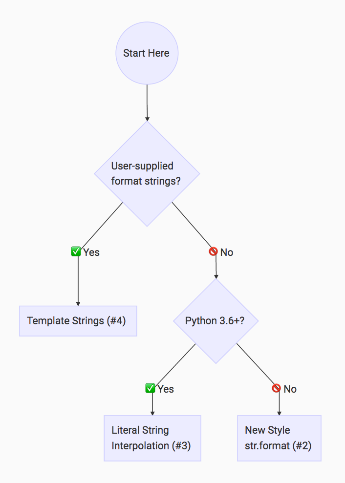

# Basics of Python

## Comments

A comment starts with a hash character (#) that is not part of a string literal, and ends at the end of the physical line. A comment signifies the end of the logical line unless the implicit line joining rules are invoked. Comments are ignored by the syntax.

```python
# comment example 
```

## KeyWords

The following identifiers are used as reserved words, or keywords of the language, and cannot be used as ordinary identifiers. They must be spelled exactly as written here:

|       |        |         |          |            |
| ----- | ------ | ------- | -------- | ---------- |
| `as`  | `del`  | `None`  | `class`  | `global`   |
| `if`  | `for`  | `pass`  | `False`  | `import`   |
| `in`  | `not`  | `True`  | `raise`  | `lambda`   | 
| `is`  | `try`  | `with`  | `while`  | `return`   |
| `or`  | `elif` | `async` | `yield`  | `finally`  |
| `and` | `else` | `await` | `assert` | `continue` |
| `def` | `from` | `break` | `except` | `nonlocal` |        

### Soft KeyWords

Some identifiers are only reserved under specific contexts. These are known as soft keywords. The identifiers match, case, type and _ can syntactically act as keywords in certain contexts, but this distinction is done at the parser level, not when tokenizing.

As soft keywords, their use in the grammar is possible while still preserving compatibility with existing code that uses these names as identifier names.

match, case, and _ are used in the match statement. type is used in the type statement.
               
## Operators

### Arithmetic Operators

| Symbol | Description |
| ------ | ----------- |
| `+` | Addition it Number values. Ex: `1 + 3` |
| `-` | Subtraction it Number values. Ex: `1 - 3` |
| `*` | Multiplication it Number values. Ex: `1 * 3 = 1 x 3` |
| `**` | Exponentiation it Number values. Ex: `1 ** 3 = 1^3` |
| `/` | true division it Number values, result in float. Ex: `1 / 3 = 0.33`  |
| `//` | floor Division it Number values, result in int. Ex: `1 // 3 = 0` |
| `%` | Modulus it Number values. Ex: `1 % 3 = 1` |

### Comparison Operators

#### - Relational Operators

| Symbol | Description |
| ------ | ----------- |
| `>` | Greater than operator. Ex: 1 > 3, result in False |
| `<` | Less than operator. Ex: 1 < 3, result in True |
| `>=` | Greater than or equal operator. Ex: 1 >= 3, result in False |
| `<=` | Less than or equal operator. Ex: 1 <= 3, result in True |

#### - Equality Operators

| Symbol | Description |
| ------ | ----------- |
| `==`| Equal operator. Ex: 1 == 3, result in False |
| `!=`| Not equal operator. Ex: 1 != 3, result in True |

### Logical Operators

| Symbol | Description |
| ------ | ----------- |
| `and` | Logical AND. True if both the operands are true |
| `or` | Logical OR. True if either of the operands is true |
| `not` | Logical NOT. True if the operand is false |

### Identity Operators

Identity operators are used to check if two values are located on the same part of the memory, in other words, if they are the same object.

| Symbol | Description |
| ------ | ----------- |
| `is` | True if the operands are identical |
| `is not` | True if the operands are not identical |

### Membership Operators

Membership operators that are used to test whether a value or variable is in a sequence. Can used with Strings or Collections.

| Symbol | Description |
| ------ | ----------- |
|`in`| True if value is found in the sequence |
|`not in`| True if value is not found in the sequence |

### Bitwise Operators

Bitwise operators are used to perform bitwise calculations on integers.
The integers are first converted into binary and then operations are performed on each bit or corresponding pair of bits, hence the name bitwise operators. The result is then returned in decimal format.<br>It is not one of the most used operators but it is interesting to know its existence.

| Symbol | Description |
| ------ | ----------- |
| `&` | Bitwise AND |
| `\|` | Bitwise OR |
| `~` | Bitwise NOT |
| `^` | Bitwise XOR |
| `>>` | Bitwise right shift|
| `<<` | Bitwise left shift |

### Order of Precedence

| Symbol | Description | 
| ------ | ----------- |
| `( )` | Parentheses |
| `**` | Exponentiation|
|`+x` `-x` `~x`| Unary plus, unary minus, and bitwise NOT |
| `*` `/` `//` `%` | Multiplication, division, floor division, and modulus |
| `+` `-` | Addition and subtraction |
|`<<` `>>`| Bitwise left and right shifts |
|`&`| Bitwise AND |
|`^`| Bitwise XOR |
|`\|`| Bitwise OR |
|`==` `!=` `>` `>=` `<` `<=` `is` `is not` `in` `not in` |Comparisons, identity, and membership operators|
|`not`| Logical NOT |
|`and`| Logical AND |
|`or`| Logical OR |

## Control Structures

### Sequential statements ( Sequence Structure )

Sequential instructions are the most used type of control structure, where instructions are executed one after the other, following the standard code flow.

example:
~~~python
>>> a = 5
>>> b = 6
>>> print(a + b)
11
~~~

### Condicional Statements ( Selection Structure )

The selection statement allows a program to test several conditions and execute instructions based on which condition is true. This is used for decisions and branches

#### - <b>if</b> Statement

The <b>if</b> statement is used for conditional execution:

~~~
if_stmt ::=  "if" assignment_expression ":" suite
             ("elif" assignment_expression ":" suite)*
             ["else" ":" suite]
~~~

It selects exactly one of the suites by evaluating the expressions one by one until one is found to be <b>true</b>;  then that suite is executed. If all expressions are <b>false</b>, the suite of the <b>else</b> clause, if present, is executed.

#### - <b>match</b> Statement
The <b>match</b> statement is used for pattern matching. Syntax:

~~~
match_stmt   ::=  'match' subject_expr ":" NEWLINE INDENT case_block+ DEDENT
subject_expr ::=  star_named_expression "," star_named_expressions?
                  | named_expression
case_block   ::=  'case' patterns [guard] ":" block
~~~

>**_Note:_** This section uses single quotes to denote soft keywords.

Pattern matching takes a pattern as input (following case) and a subject value (following match). The pattern (which may contain subpatterns) is matched against the subject value. The outcomes are:

* A match success or failure (also termed a pattern success or failure).

* Possible binding of matched values to a name.

### Loop Statements ( Repetition Structure )

A repetition statement is used to repeat a group(block) of programming instructions. This is used for looping in code.
In Python we have the determined loop (for) and the indeterminate loop (while).

#### - <b>while</b> statement

The <b>while</b> statement is used for repeated execution as long as an expression is true:

~~~
while_stmt ::=  "while" assignment_expression ":" suite
                ["else" ":" suite]
~~~

This repeatedly tests the expression and, if it is <b>true</b>, executes the first suite; if the expression is <b>false</b> (which may be the first time it is tested) the suite of the <b>else</b> clause, if present, is executed and the loop terminates.

A <b>break</b> statement executed in the first suite terminates the loop without executing the else clause’s suite. A <b>continue</b> statement executed in the first suite skips the rest of the suite and goes back to testing the expression.

#### - <b>for</b> statement

The <b>for</b> statement is used to iterate over the elements of a sequence (such as a string, tuple or list) or other iterable object:

~~~
for_stmt ::=  "for" target_list "in" starred_list ":" suite
              ["else" ":" suite]
~~~
The starred_list expression is evaluated once; it should yield an iterable object. An iterator is created for that iterable. The first item provided by the iterator is then assigned to the target list using the standard rules for assignments, and the suite is executed. This repeats for each item provided by the iterator. When the iterator is exhausted, the suite in the else clause, if present, is executed, and the loop terminates.

 A <b>break</b> statement executed in the first suite terminates the loop without executing the else clause’s suite. A <b>continue</b> statement executed in the first suite skips the rest of the suite and continues with the next item, or with the else clause if there is no next item.

The for-loop makes assignments to the variables in the target list. This overwrites all previous assignments to those variables including those made in the suite of the for-loop:

~~~python
for i in range(10):
    print(i)
    i = 5           # this will not affect the for-loop
                    # because i will be overwritten with the next
                    # index in the range
~~~

Names in the target list are not deleted when the loop is finished, but if the sequence is empty, they will not have been assigned to at all by the loop. Hint: the built-in type range() represents immutable arithmetic sequences of integers. For instance, iterating range(3) successively yields 0, 1, and then 2.

## Python Collections (Arrays)
There are four collection data types in the Python programming language:

1. `List` is a collection which is ordered and changeable. Allows duplicate members.

How implement:
```python
mylist = ["banana","apple","grape"]
```

2. `Tuple` is a collection which is ordered and unchangeable. Allows duplicate members.

How implement:
```python
mytuple = ("banana","apple","grape")
```

3. `Set` is a collection which is unordered, unchangeable ( but can remove for replace ) and unindexed. No duplicate members.

How implement:
```python
myset = {"banana","apple","grape"}
```

4. `Dictionary` are used to store data values in `key:value pairs` in a collection which is ordered ( in actual versions ) and changeable. No duplicate members.

How implement:
```python
thisdict {
    "name": "Arthur",
    "age": 10,
    "favorite food": "pizza"
}
```

## Some Escape Sequences

| Escape Sequence | Description |
| --------------- | ----------- |
| `\<newline>` | Backslash and newline ignored |
| `\n` | Newline. Move the screen cursor to the beginning of the next line. |
| `\\` | Backslash. Print a backslash character. |
| `\"` | Double quote. Print a double quote character. |
| `\'` | Single quote. Print a single quote character. |
| `\a` | Alert. Sound the system bell. |
| `\b` | Backspace. Move the screen cursor back one space. |
| `\r` | Carriage return. Move the screen cursor to the beginning of the current line; do not advance to the next line. |
| `\t` | Horizontal tab. Move the screen cursor to the next tab stop. |
| `\ooo` | Character with octal value ooo|
| `\xhh` |Character with hex value hh|
| `\uxxxx` | Character with 16-bit hex value xxxx |
| `\Uxxxxxxxx` | Character with 32-bit hex value xxxxxxxx |
| `\N{name}` | Character named name in the Unicode database |


## Formatting String

### 1. “Old Style” String Formatting (% Operator)

String objects have one unique built-in operation: the % operator (modulo). This is also known as the string formatting or interpolation operator. Given format % values (where format is a string), % conversion specifications in format are replaced with zero or more elements of values.

A conversion specifier contains two or more characters and has the following components, which must occur in this order:

> 1. The '%' character, which marks the start of the specifier.
> 2. Mapping key (optional), consisting of a parenthesised sequence of characters (for example, (somename)).
> 3. Conversion flags (optional), which affect the result of some conversion types.
> 4. Minimum field width (optional). If specified as an '*' (asterisk), the actual width is read from the next element of the tuple in values, and the object to convert comes after the minimum field width and optional precision.
> 5. Precision (optional), given as a '.' (dot) followed by the precision. If specified as '*' (an asterisk), the actual precision is read from the next element of the tuple in values, and the value to convert comes after the precision.
> 6. Length modifier (optional).
> 7. Conversion type.

The conversion flag characters are:

| Flag | Meaning |
| ---- | ------- |
| `'#'` | The value conversion will use the “alternate form” (where defined below). | 
| `'0'` | The conversion will be zero padded for numeric values. |
| `'-'` | The converted value is left adjusted (overrides the '0' conversion if both are given). |
| `' '` | (a space) A blank should be left before a positive number (or empty string) produced by a signed conversion. |
| `'+'` | A sign character ('+' or '-') will precede the conversion (overrides a “space” flag). |

The conversion types are:

| Conversion | Meaning |
| ----------------- | ----------- |
| `'d'` | Signed integer decimal. |
| `'i'` | Signed integer decimal. |
| `'p'` | Signed octal value. |
| `'u'` | Obsolete type – it is identical to 'd'. |
| `'x'` | Signed hexadecimal (lowercase). |
| `'X'` | Signed hexadecimal (uppercase). |
| `'e'` | Floating point exponential format (lowercase). |
| `'E'` | Floating point exponential format (uppercase). |
| `'f'` | Floating point decimal format. |
| `'F'` | Floating point decimal format. |
| `'g'` | Floating point format. Uses lowercase exponential format if exponent is less than -4 or not less than precision, decimal format otherwise. |
| `'G'` | Floating point format. Uses uppercase exponential format if exponent is less than -4 or not less than precision, decimal format otherwise. |
| `'c'` | Single character (accepts integer or single character string). |
| `'r'` | String (converts any Python object using repr()). |
| `'s'` | String (converts any Python object using str()). |
| `'a'` | String (converts any Python object using ascii()). |
| `'%'` | No argument is converted, results in a '%' character in the result. |

> [!NOTE]
> 1. The alternate form causes a leading octal specifier ('0o') to be inserted before the first digit.
> 2. The alternate form causes a leading '0x' or '0X' (depending on whether the 'x' or 'X' format was used) to be inserted before the first digit.
> 3. The alternate form causes the result to always contain a decimal point, even if no digits follow it.
> 4. The precision determines the number of digits after the decimal point and defaults to 6.
> 5. The alternate form causes the result to always contain a decimal point, and trailing zeroes are not removed as they would otherwise be.
> 6. The precision determines the number of significant digits before and after the decimal point and defaults to 6.
> 7. If precision is N, the output is truncated to N characters.
> 8. See [PEP 237](https://peps.python.org/pep-0237/).

> [!IMPORTANT] <br>
> Since Python strings have an explicit length, %s conversions do not assume that '\0' is the end of the string.<br>
>Changed in version 3.1: %f conversions for numbers whose absolute value is over 1e50 are no longer replaced by %g conversions.

### “New Style” String Formatting (str.format)
Performs a string formatting operation using a method called format( ) on a string that contains literal text and replacement fields delimited by square brackets {}. Each replacement field can contain a numeric index of a positional argument or the name of a keyword argument. Returns a copy of the string where each replacement field is replaced with the string value of the corresponding argument.

Example replacement with numeric index:
~~~python
>>> print("The sum of 1 + 2 is {0}".format(1+2))
'The sum of 1 + 2 is 3'
~~~

Named replacement Example of a Keyword Argument:
~~~python
>>> name = "Arthur"
>>> print("My name is {name}".format(name = name))
'My name is Arthur'
~~~

Simples positional formatting:
~~~python
>>> name = "Arthur"
>>> print("Hello, {}".format(name))
'Hello, Arthur'
~~~

### String Interpolation / f-Strings (Python 3.6+)
That is literal string interpolation, also called fString. It is present in Python versions 3.6+. This new way of formatting strings lets you use embedded Python expressions inside string constants.<br>

simple interpolation example:
~~~python
>>> name = "Arthur"
>>> print(f'Hello, {name}!')
'Hello, Arthur!'
~~~

Inline arithmetic expression example:
~~~python
>>> a = 10
>>> b = 3
>>> print(f'{a + b} is lower then {a * b}')
'13 is lower then 30'
~~~

Example of formating float value limit the decimal places that will be displayed:
~~~python
>>> number = 543.3221123
>>> print(f'{number:.2f}')
'543.32'
~~~

### Template Strings (Standard Library)
Template is a class from Python’s built-in string module. To use it, you need to import the class. Overall, it is a simple and more limited method than the others, but it fulfills the necessary role.

simple interpolation example:
~~~python
from string import Template

text = Template("Hello, $name!")
print(text.substitute(name = "Arthur"))
~~~

### Reference image for choose of String Formatting


## References
- [W3schools tutorial python](https://www.w3schools.com/python/default.asp)
- [documentation of lexical analysis in python.org](https://docs.python.org/3/reference/lexical_analysis.html)
- [documentation string formatting](https://docs.python.org/3/library/stdtypes.html#printf-style-string-formatting)
- [Article "Python String Formatting Best Practices"](https://realpython.com/python-string-formatting/)
- [Content about operators in Python](https://www.geeksforgeeks.org/python-operators/)
- [Content about Control Flow Statements](https://www.educative.io/answers/what-are-control-flow-statements-in-python)
- [Compound Statements documentation](https://docs.python.org/3/reference/compound_stmts.html)